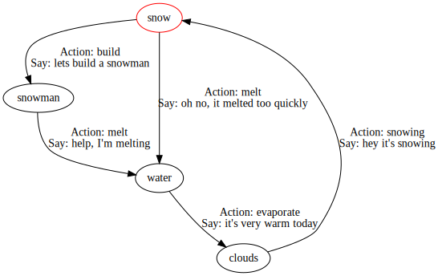

# About these bot dialog state machines
The statemachine initialisers in this directory are used to call constructors for instances of the StateMachines class. Statemachines are a wonderful way of representing conversational dialogue, but when coding them they can suffer from being hard to visualise and therefore easy to make coding mistakes.

## (Self) Documentation

One of the methods of the StateMachine class: describe(), produces a GraphViz digraph description file so that the statemachine can be visualised. The top level project gulp.js uses this to document statemachines. Add new .js definition files to the `statemachines` list in gulp.js.


## Structure
Each .js file should define and export a top level object definition which can be used directly by:
e.g.
```
stateDefinition = require('statemachine.js');
sm = new StateMachine(stateDefinition, this);
```

The Object has two top level properties, `name`, and `init`. `name` is the pretty print name of the machine, `init` is the default initial state (which can be overriden in the call to the StateMachine constructor)

It then contains a child object called states that contains a key for each state name in the machine and a set of possible `transitions` from that state to other states.

Each transition has keys:
* `to` (mandatory): the state to transition to
* `emit` (optional): a text string emitted on transition (note that in Polite.AI usage this isn't directly an emittable text string, but is instead a key to a string in the language definition file which may be further substituted knowledge variables from the environment)
* `run` (optional): a function to execute when this transition occurs. This will be run with the `env` object originally passed to the constructor for the state machine.

## Example

```
const snowman = {
  name: "Snowman State Transitions",
  init: "snow",
  states: {
    "snow": {
      transitions: {
        build: {
          to: 'snowman',
          emit: 'lets build a snowman'
        },
        melt: {
          to: 'water',
          emit: "oh no, it melted too quickly"
        }
      }

    },
    "snowman": {
      transitions: {
        melt: {
          to: 'water',
          emit: "help, I'm melting"
        }
      }
    },
    "water": {
      transitions: {
        evaporate: {
          to: 'clouds',
          emit: "it's very warm today"
        }
      }
    },
    "clouds": {
      transitions: {
        snowing: {
          to: 'snow',
          emit: "hey it's snowing"
        }
      }
    }
  }
}
module.exports = snowman;
```

Produces a GraphViz .dot file
```
digraph "Snowman State Transitions" {
  "snow" [color=red];
  "snowman";
  "water";
  "clouds";
  "snow" -> "snowman" [ label="Action: build\nSay: lets build a snowman"]
  "snow" -> "water" [ label="Action: melt\nSay: oh no, it melted too quickly"]
  "snowman" -> "water" [ label="Action: melt\nSay: help, I'm melting"]
  "water" -> "clouds" [ label="Action: evaporate\nSay: it's very warm today"]
  "clouds" -> "snow" [ label="Action: snowing\nSay: hey it's snowing"]
}
```

And the visualisation:


