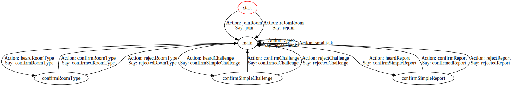

# Dialog State Machines

The dialogue state machines in this directory implement the bot conversations. They are self documenting (see [ABOUT.md][ab5073d4] for details)

  [ab5073d4]: ABOUT.md "ABOUT file"

## dialogstates.js

Main bot statemachine, covers interactions with room owner to get type of room, and with participants to Appeal classifications and report unflagged abuse.

All of the `say` tokens in this machine correspond to Language class natural language utterances specified in [../language/*.json](../language/english.json)

All the exec functions expect to be executed in an environment that has a `room` Object that corresponds to the room we are in.
